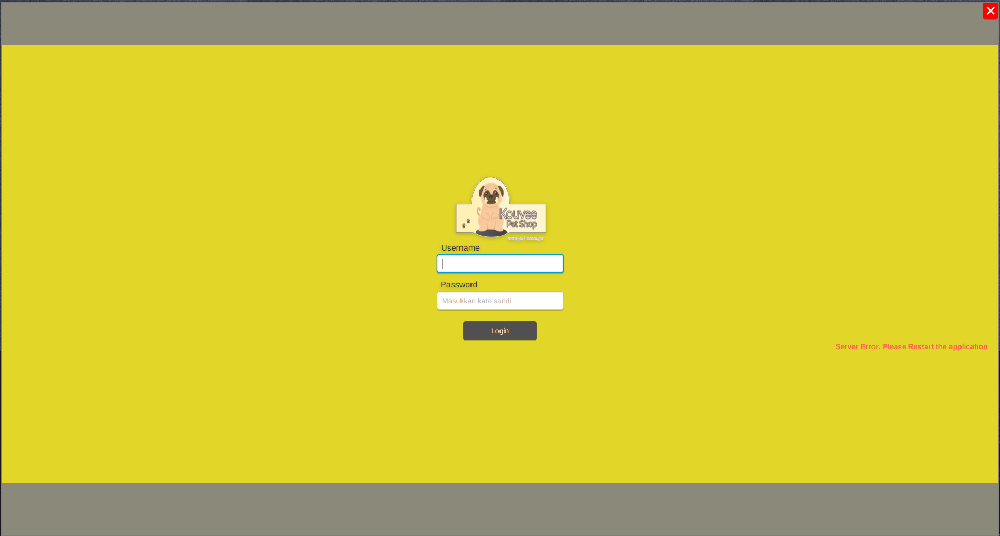

# Kouvee Pet Shop Desktop Application

This is the desktop version of Kouvee Petshop for P3L's final submission.
## Developer Guide
### Requirement
1. Open JDK 13 or newer
2. IntelliJ IDEA
3. Scene Builder
4. JavaFX SDK 12 or newer
### IDE Plugin
1. Lombok
### Documentation to Read
1. OpenJFX documentation
2. Lombok documentation
3. How to integrate Scene Builder with Intellij IDEA

## Contributors
1. [Natan Hari Pamungkas](https://github.com/natanhp)
2. [Yakobus Nobel Judo Prajitno](https://github.com/YakobusNobels)
3. [Arum Puspa Belinda](https://github.com/arumbelinda)
4. [Adelbertus Larry](https://github.com/L4rryToru4n)